# Edge Impulse Example: standalone inferencing (Silabs Gecko SDK 4.x)

This builds and runs an exported impulse locally on your machine. See the documentation at Deploy your model as a SLCC component.

## Basic steps

1. Export SLCC component form Studio
1. Extract content of the exported component into `ei-model` directory.
1. Build project

### Building from command line

1. Install [SLC CLI Tools](https://www.silabs.com/documents/public/user-guides/ug520-software-project-generation-configuration-with-slc-cli.pdf)
1. Install [Simplicity Commander](https://community.silabs.com/s/article/simplicity-commander?language=en_US)
1. Install [Gecko SDK 4.x](https://github.com/SiliconLabs/gecko_sdk) and configure it in the SLC CLI
1. Generate Makefile for your board (for example BRD4166A - Thunderboard Sense 2)

    ```
    slc generate inference-example.slcp -cp -np --toolchain=gcc --output-type=makefile --with=brd4166a
    ```

1. Compile

    ```
    make -f inference-example.Makefile -j
    ```

1. Flash

    ```
    commander flash build/debug/inference-example.hex
    ```

### Building using Simplicity Studio 5

1. Install [Simplicity Studio 5](https://www.silabs.com/developers/simplicity-studio)
1. Install Gecko SDK 4.x in the Simplicity Studio (`Help -> Update Software` or `Install` on the top toolbar)
1. Click `Import projects...` in the `Project Explorer` window

    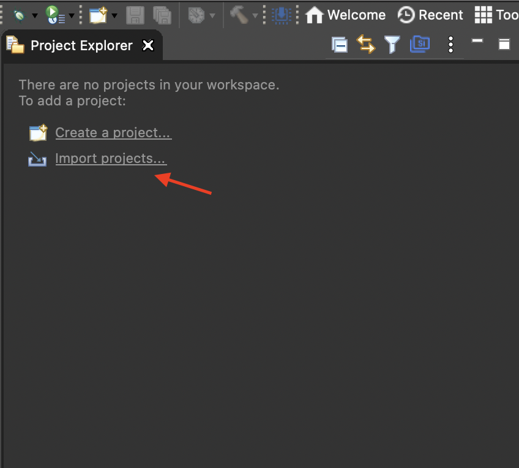

1. Select `MCU Project` in the `Simplicty Studio` group

    

1. Choose the location with this repository cloned on your disk and click `Next`

    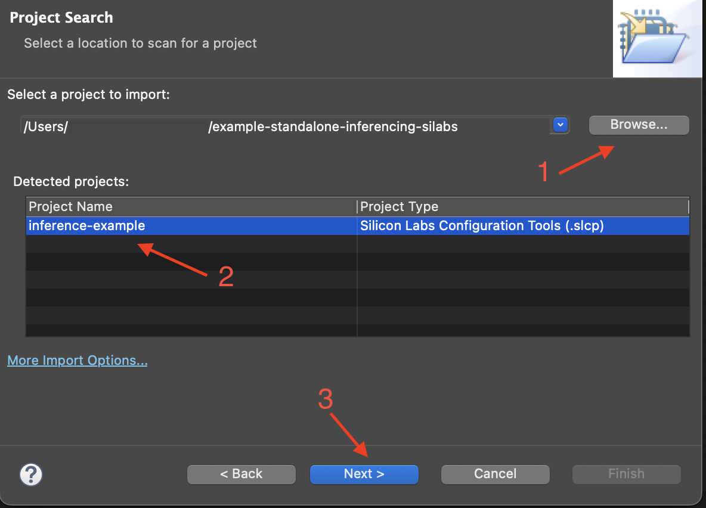

1. Ingore error about `Device part of the build configuration cannot be resolved` and go to `Next` step

    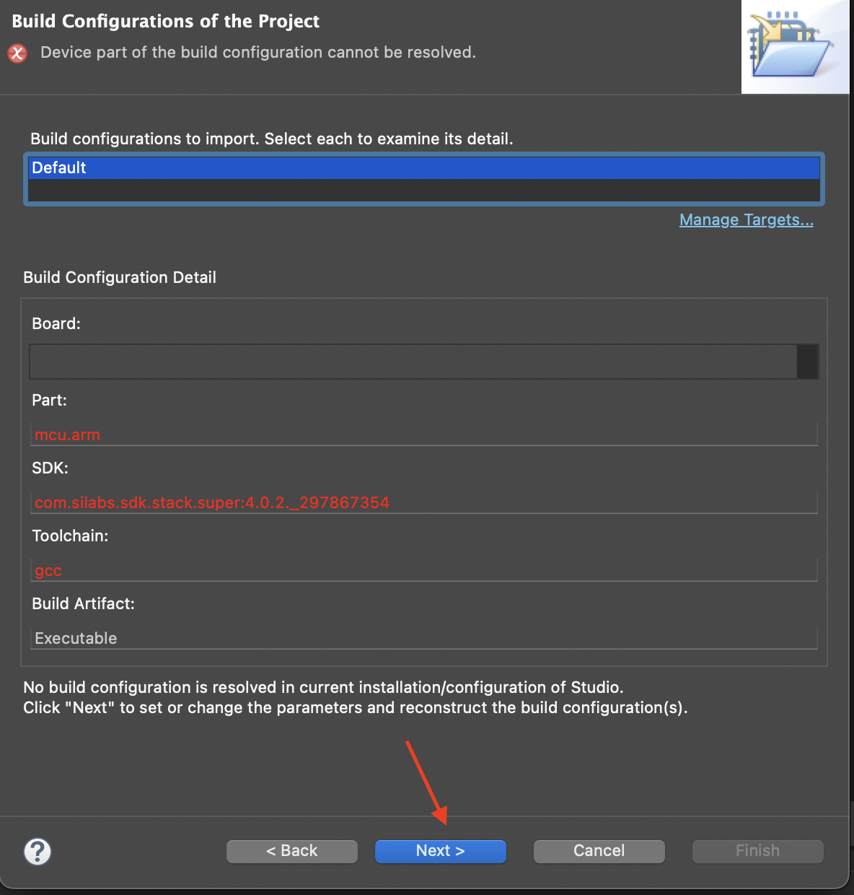

1. Select target board on `Reconstruct Build Configuration` stage (eg. `BRD2601B`). Make sure you have selected `Gecko SDK 4.x` (4.0.2 or newest) and Toolchain `GNU ARM v10.2.1`

    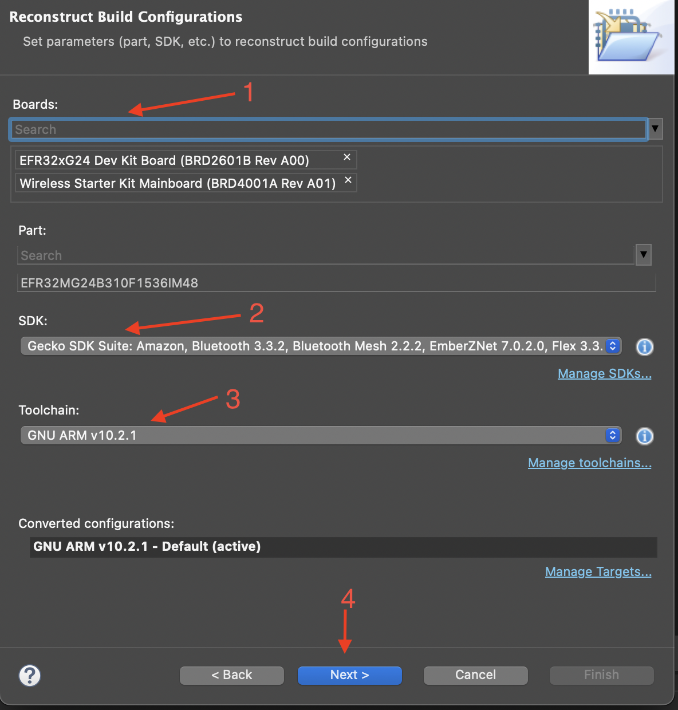

1. Choose the location for a new project in your workspace

    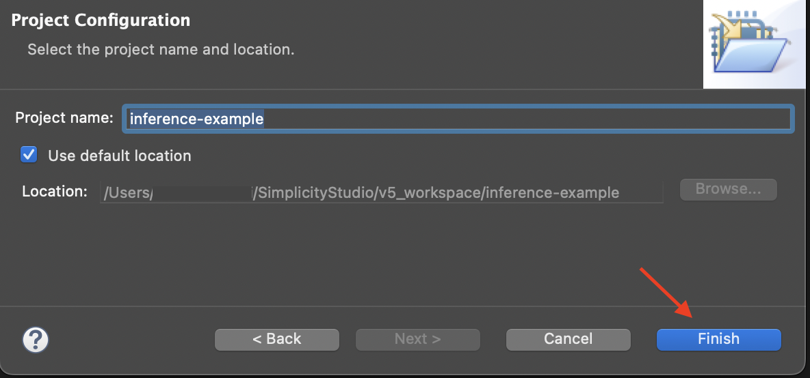

1. After importing, remove `ei-model` form `Project Explorer`

    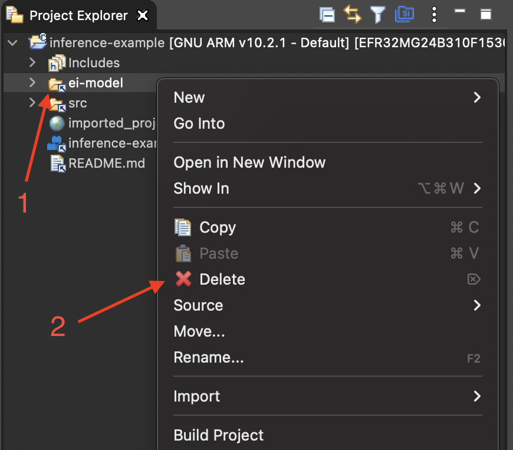

1. Confirm removing of the link only

    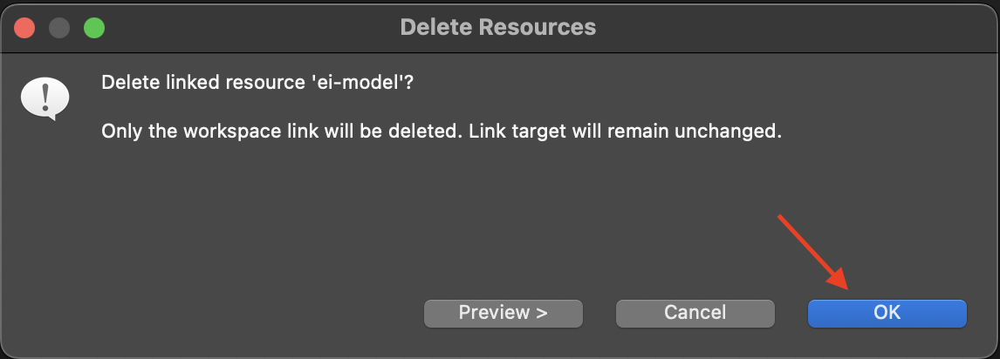

1. Open `inference-example.slcp` file

    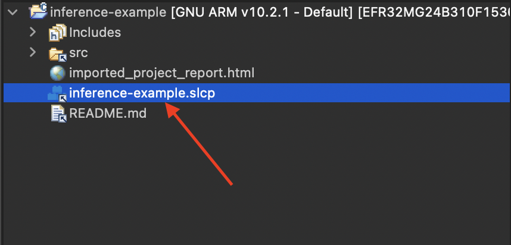

1. Clik `Force Generation` in the center panel

    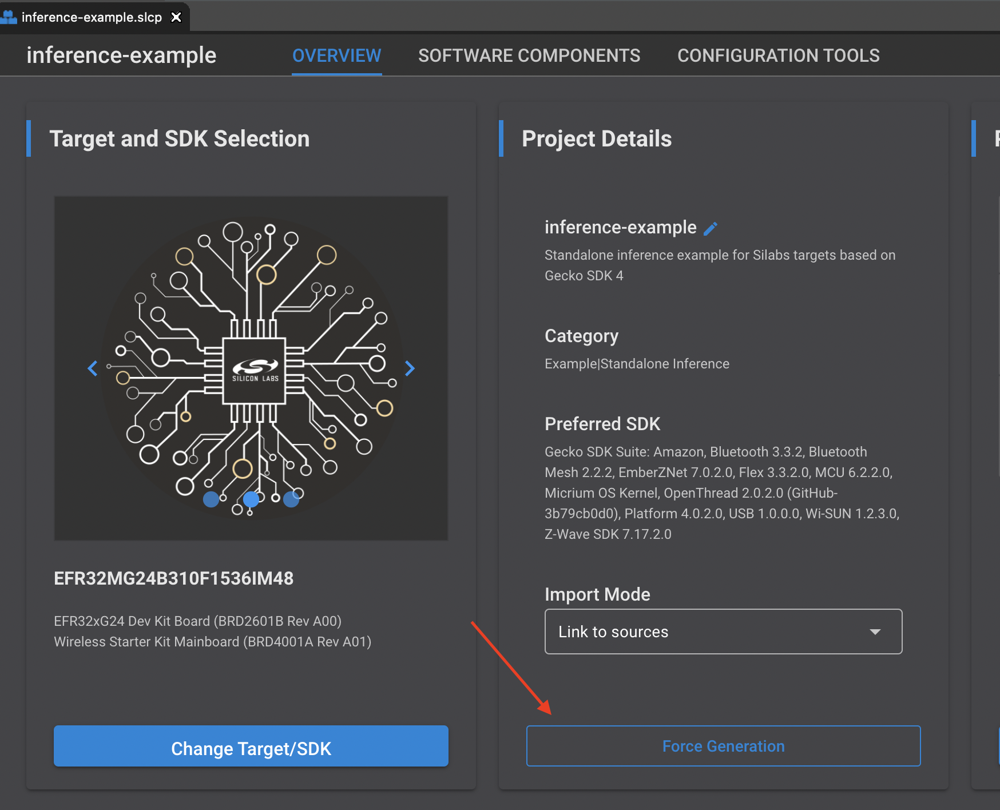

1. After generation is complete, right click on the project file and choose `Build Project`

    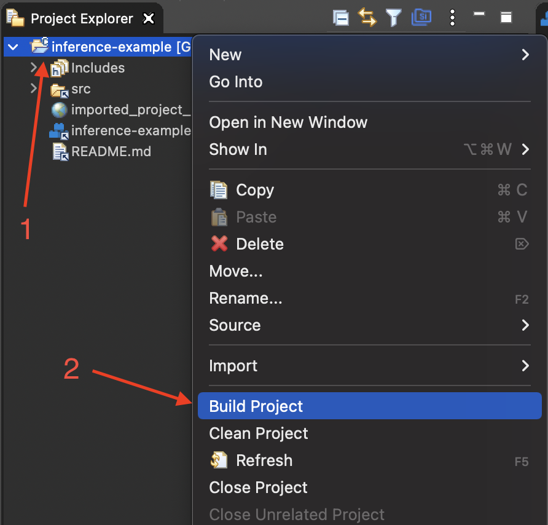

1. Flash the program by right clicking on the project file and select `Run As` and `1 Silicon Labs ARM Program`

    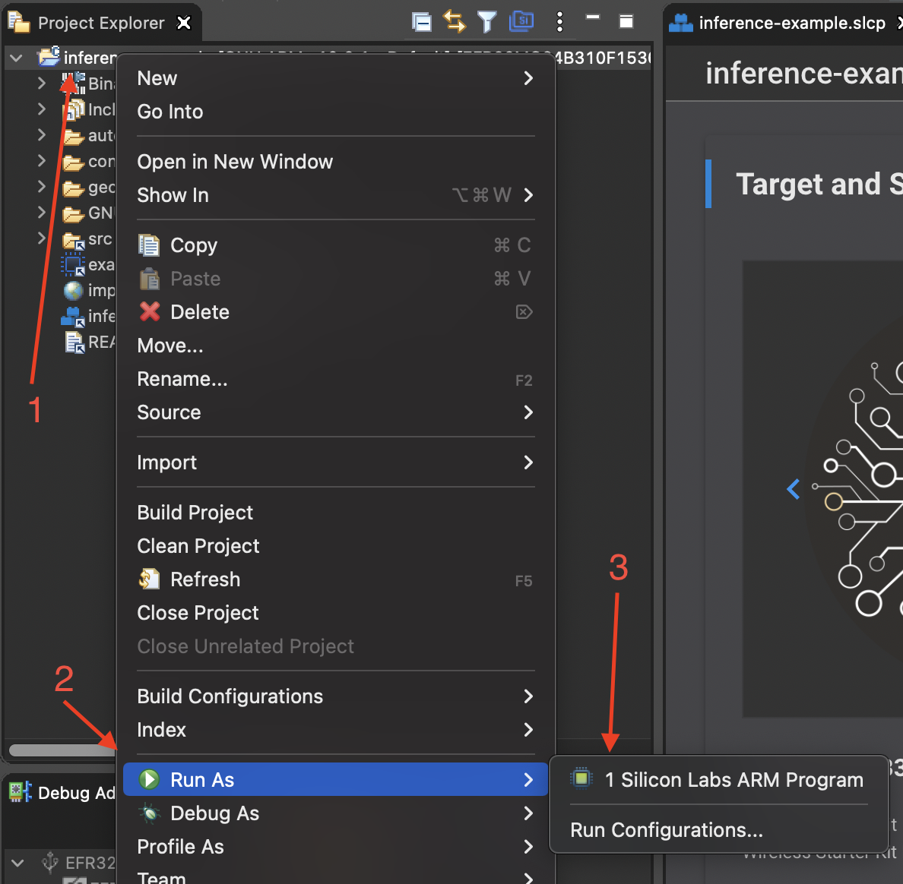

 ## License

 [Appache License v2.0](https://www.apache.org/licenses/LICENSE-2.0)
 